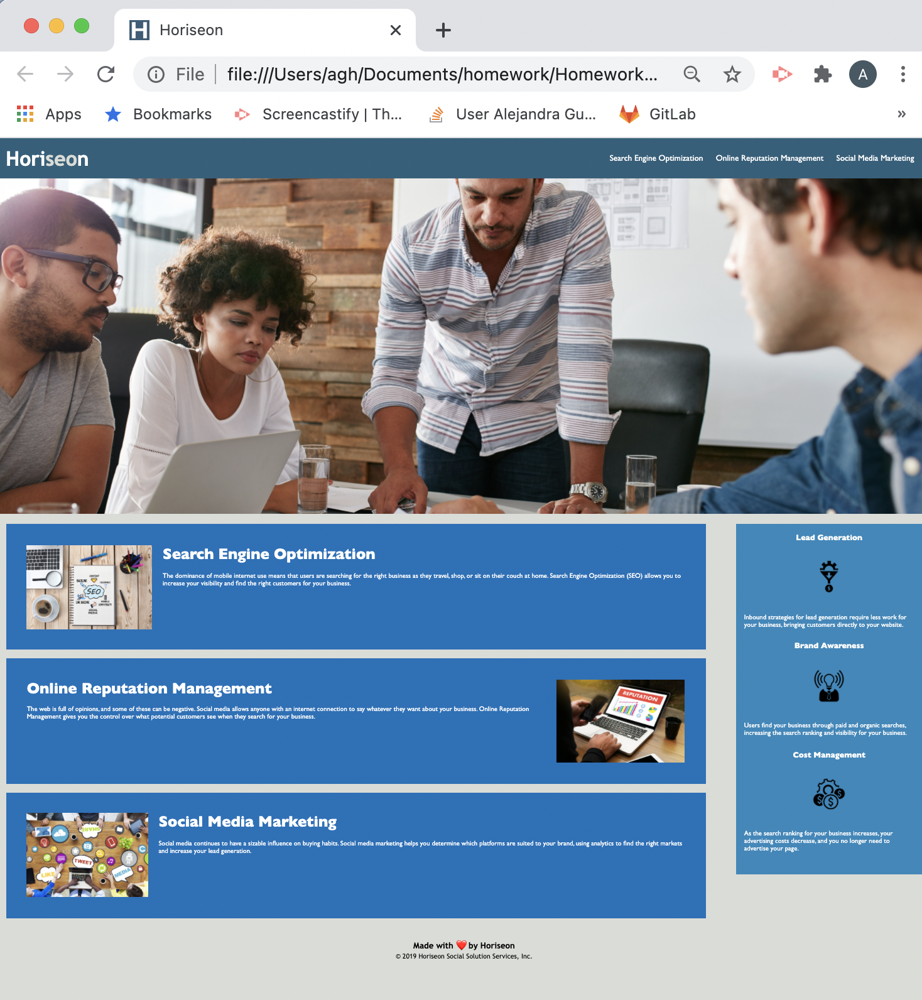

# Homework1_repo

Optimized and corrected the original HTML and CSS files to meet the acceptance criteria. 

## HTML

* Looked for `missing details` and added some more. i.e. Title name and icon
* Changed some elemnets name to use `semantic HTML` elements that made the code more comprehensive.
* Did a clean-up of `classes` and `ids`, based on common characteristics and needs
* Added `alt` to every image that needed a description

## CSS

* Made some `classes into elements` 
* `Changed element names` based on HTML changes
* Eliminated `classes with same characteristics` and changed the name of the class according to the HTML changes
* Changed the SEO `from class to id` as it was only for 1 element
* Organized the stylesheet `from general to specific`.

## Final result

